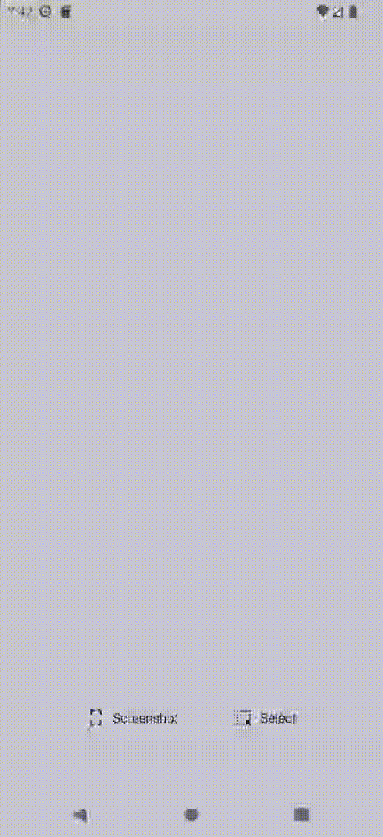

# WWTestApp

## Test app

### Remote config (status: false, link: "https://www.google.com")

### Remote config (status: true, link: "https://www.google.com")

### Remote config (status: true, link: "https://www.google.com"). WebView has been shown and saved locally link from Remote Config.

